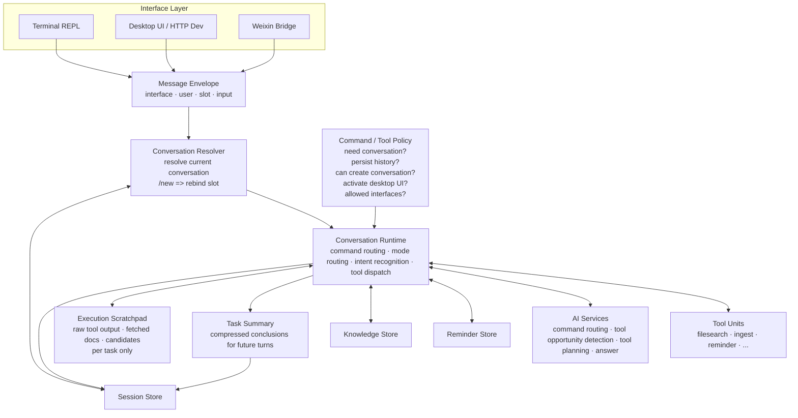

# myclaw

`myclaw` 是一个跨终端、桌面和微信三种入口的个人智能助理。它的目标不是做三个彼此独立的小程序，而是做一个统一的对话内核，再通过不同接口把能力暴露给用户。

当前仓库正在进行一次架构收口。下面的“设计原则”和 Mermaid 图描述的是本轮重构要遵守的目标架构，不代表所有历史实现都已经完全符合；后续代码修改应优先向这套模型靠拢，而不是继续在接口层堆分支。

## 设计原则

- 终端、桌面端、微信端都只是接口层。它们负责收发消息、展示结果、触发少量接口专属动作，不负责定义核心业务语义。
- 核心流程是“先解析当前对话，再处理消息”。命令、普通提问、工具调用都应建立在统一的会话解析结果之上。
- AI 不应只做单次问答分类。核心设计是一个通用 AI 决策器：先识别需求，再匹配工具，再根据工具契约生成调用方案，并在需要时基于已有结果继续迭代 2 到 3 轮。
- `/new` 的语义不是“执行一个特殊命令”，而是“把当前接口槽位重新绑定到一个新的对话”。
- 微信端默认绑定一个已有对话；如果当前槽位没有已绑定对话，才建立一个新的默认对话。
- 命令和工具默认运行在当前对话上下文中；是否写入历史、是否允许创建新对话、是否触发桌面 UI 激活，应该由统一策略决定，而不是由某个接口临时硬编码。
- 上下文必须分层管理。任务执行中的原始工具输出、网页摘录、候选结果只属于临时 scratchpad；任务结束后只保留面向后续轮次的任务摘要；真正进入长期会话历史的内容必须是经过筛选的对话记忆，而不是原始中间产物。
- 微信端可以更薄地呈现结果，但 desktop 与 weixin 的 agent tool 候选集默认必须保持一致；不要再按接口名把工具能力做成两套。

## 目标架构



## 会话语义

- 每个接口都先把输入封装成统一消息，再进入会话解析层。
- 桌面端和终端通过显式会话选择或创建来确定当前会话。
- 微信端通过“接口槽位”确定当前会话。默认按微信用户稳定复用已有绑定，`ContextToken` 只用于回复发送；只有输入 `/new` 或绑定丢失时，才切换到新对话。
- “查看帮助”“查看知识库状态”“找文件”“发文件”等动作是否写入聊天历史，不由接口决定，而应由统一命令策略决定。
- 同一个动作在不同接口上可以有不同的可用性和返回形式，但不应该拥有不同的会话生命周期定义。
- desktop 与 weixin 的 `ListAgentToolDefinitions` 默认应保持一致；只有平台本身做不到，或用户明确关闭某个工具时，才允许候选工具集合出现差异。
- 一次任务完成后，不应把原始工具输出直接塞回下一轮上下文。下一轮应该读取任务摘要或裁剪后的会话记忆，而不是执行阶段的原始材料。

当前版本刻意保持简单：

- 运行时状态统一存储在本地 `app.db` 里
- 模型配置从本地模型数据库读取，密钥单独保存在 `model/secret.key`
- 配置模型后，会先做 AI 命令路由，再决定是“记住 / 遗忘 / 提醒 / 查看 / 回答”
- 工具调用不再依赖某个工具专属的意图提取入口；当前文件检索已经走“识别需求 -> 匹配工具 -> 读取工具契约 -> 生成检索方案 -> 执行 -> 按结果迭代”的通用决策链，最多 3 轮
- 当前运行时已经引入三层上下文：任务 scratchpad 保存原始中间产物；任务摘要写入下一轮模型上下文；会话历史保留最终对话文本与调试元数据
- 普通问题默认走 agent 模式；需要传统一问一答时可用 `@ai`，需要单条附加知识库检索时可用 `@kb`
- desktop 新建对话时会先选择 `ask` 或 `agent`，模式在该会话创建时确定
- 支持图片直接总结入库；PDF 走 `go-fitz` 提取全文后再总结
- 支持单次提醒和每天重复提醒
- 桌面主会话与提醒面板会聚合显示当前运行时里的提醒，并标注来源（如桌面、微信）
- 微信桥接只保留扫码登录、长轮询、文本/语音文字收发
- 不做向量检索、权限隔离或多租户隔离

## 目录

```text
cmd/myclaw            CLI / terminal 入口
cmd/myclaw-desktop    Wails 桌面端与 HTTP dev 入口
cmd/myclaw-eval       模型评估 CLI，运行 eval/testdata/*.jsonl 数据集
internal/app          统一对话运行时、会话逻辑、命令分发
internal/ai           AI 命令路由、通用工具决策、回答与摘要
internal/filesearch   独立文件检索工具单元
internal/knowledge    本地知识库存储
internal/modelconfig  模型配置读取与存储
internal/reminder     提醒调度与持久化
internal/runtimepolicy 跨接口共享的命令/输入策略定义
internal/taskcontext  单次任务 scratchpad 与任务摘要状态
internal/terminal     终端接口适配
internal/toolcontract 统一工具契约定义
internal/weixin       微信接口适配、消息桥接与文件发送能力
internal/dirlist      list_directory 工具单元，原生文件系统目录列举
internal/bashtool     bash_tool 工具单元，Linux/macOS 只读 shell 命令
internal/powershelltool powershell_tool 工具单元，Windows 只读 PowerShell 命令
internal/sessionstate 会话快照持久化（历史消息、模式、已加载技能）
internal/skilllib     技能加载与管理
internal/fileingest   图片与 PDF 摄入（视觉总结 / go-fitz 全文提取）
internal/promptlib    提示词模板管理与存储
internal/projectstate 项目运行时状态跟踪
internal/sqliteutil   SQLite 公共工具函数
```

相关文档：

- [docs/ai-stage-eval.md](./docs/ai-stage-eval.md)：AI 阶段评测说明
- [docs/tool-units.md](./docs/tool-units.md)：可复用工具单元规范
- [docs/development-issues.md](./docs/development-issues.md)：开发问题记录与排障经验

## 运行

### 0. 终端模式

直接运行即可进入终端：

```bash
go run ./cmd/myclaw
```

或者显式指定：

```bash
go run ./cmd/myclaw -terminal
```

### 0.5. Wails 桌面模式

直接启动桌面前端：

```bash
go run ./cmd/myclaw-desktop
```

桌面模式当前提供：

- 图片 / PDF 文件导入
- 知识库列表、补充、删除、清空
- 模型配置页面，可直接保存和测试连接
- 原生文件选择和确认对话框
- 微信页面，支持在桌面端直接显示二维码扫码登录
- 新建对话时可直接选择 `ask` 或 `agent`
- 对话面板，可继续使用 `/kb remember`、`/notice`、`/kb forget`、`/debug-search` 等命令
- 工具能力页面，可查看当前已注册的工具单元契约

桌面版默认数据目录会放到用户配置目录：

- Windows: `%LOCALAPPDATA%\myclaw\data`
- Linux/macOS: 对应系统的用户配置目录下 `myclaw/data`

如果你显式传了 `-data-dir` 或设置了 `MYCLAW_DATA_DIR`，则以传入值为准。

模型配置现在只从本地模型数据库读取，不再从 `MYCLAW_MODEL_*` 环境变量读取。

- 桌面端和 terminal 的核心状态现在统一保存在数据目录下的 `app.db`
- 模型 API Key 会配套写入 `model/secret.key`，密钥文件与数据库分离
- API Key 会单独加密后保存，前端只显示掩码，不会回填明文
- 支持多 profile，并可切换当前活跃模型
- OpenAI 支持 `responses` 和 `chat_completions`
- Anthropic 支持 `messages`

Windows PowerShell 直接运行 terminal：

```powershell
.\scripts\run-terminal.ps1
```

### 0.6. 浏览器 HTTP Dev 模式

如果你要在浏览器里调前端，而不是直接起 Wails 窗口，可以运行：

```bash
make dev
```

默认会启动：

- HTTP 地址：`http://127.0.0.1:3415`
- 同一个 Go 进程内同时提供前端静态资源和 `/api/*` 后台接口

如果要改监听地址：

```bash
make dev HTTP_DEV_ADDR=127.0.0.1:8080
```

这个模式下前端会自动切到 HTTP backend 适配层，而不是调用 `window.go` / `window.runtime`。因此：

- 模型配置、记忆管理、聊天、微信扫码状态都可以直接联调
- 文件导入会走浏览器上传接口，而不是 Wails 原生文件对话框
- 原生提醒弹窗和 Wails 事件只在桌面窗口模式下可用

### 0.7. 模型评估模式

运行 JSONL 数据集对 AI 各阶段进行评估：

```bash
go run ./cmd/myclaw-eval -dataset docs/evals/route-command.jsonl
go run ./cmd/myclaw-eval -dataset docs/evals/route-command.jsonl -output eval/testdata/runs/result.json
```

参数说明：
- `-data-dir`：数据目录（默认 `data`）
- `-dataset`：数据集文件路径（必填）
- `-output`：评估结果输出路径（默认自动生成到 `eval/testdata/runs/`）

评估数据集格式和评测规范详见 [docs/ai-stage-eval.md](./docs/ai-stage-eval.md)。

### 1. 微信扫码登录

```bash
go run ./cmd/myclaw -weixin-login
```

当前实现不依赖第三方 Go 包，但也没有内置终端二维码渲染。执行登录命令后，程序会输出 `qrcode_img_content`，你需要把这段内容生成二维码后再用微信扫码。

登录成功后，凭证会写到 `data/weixin-bridge/account.json`。

### 2. 启动微信桥接

```bash
go run ./cmd/myclaw -weixin
```

或者：

```bash
MYCLAW_WEIXIN_ENABLED=1 go run ./cmd/myclaw
```

### 3. 常用消息

- `记住：Windows 版本先做微信接口`
- `请帮我记住这个东西：未来要支持 macOS`
- `/kb remember 未来要支持 macOS`
- `/kb remember-file ./docs/puppeteer.pdf`
- `./screenshots/puppeteer-home.png`
- `/kb append 6d2d7724 它是 Google 出品的一个工具`
- `/kb`
- `/kb new 产品资料`
- `/kb switch default`
- `给 #6d2d7724 补充：它是 Google 出品的一个工具`
- `再补充一点：它是 Google 出品的一个工具`
- `/skill`
- `/skill list`
- `/skill show writer`
- `/skill load writer`
- `/skill unload writer`
- `/skill clear`
- `/prompt`
- `/prompt list`
- `/prompt use <提示词ID前缀>`
- `/prompt clear`
- `@kb macOS 什么时候做？`
- `@ai 帮我直接分析这个方案`
- `/translate Puppeteer is a browser automation tool.`
- `/kb forget 0015f908`
- `/notice 2小时后 喝水`
- `一分钟后提醒我喝水`
- `/notice 每天 09:00 写日报`
- `/notice 2026-03-30 14:00 交房租`
- `/notice list`
- `/notice remove <提醒ID前缀>`
- `/cron 每天 18:00 健身`
- `/kb list`
- `/kb stats`
- `/debug-search macOS 什么时候做？`
- `/kb clear`
- `现在我记了什么？`

文件摄入说明：

- 图片会走视觉输入，总结成适合后续检索的中文 Markdown
- PDF 会先用 `go-fitz` 提取全文，再做摘要
- 默认跨平台 release 包使用 `CGO_ENABLED=0`，因此图片可用，但 PDF 会返回“当前构建不包含 PDF 文本提取能力”
- 如果你要在 Windows 本机启用 PDF，总结请安装可用的 C 工具链后用 `.\scripts\build-windows.ps1 -UseCgo`

## 技能库

现在支持一个本地技能库，但只做人工控制，不做自动技能决策：

- `/skill` 查看当前会话已加载技能
- `/skill list` 查看技能库和当前会话加载状态
- `/skill show <技能名>` 查看某个技能内容
- `/skill load <技能名>` 手动加载一个技能到当前会话
- `/skill unload <技能名>` 从当前会话卸载一个技能
- `/skill clear` 清空当前会话已加载技能

说明：

- 模型不会自己决定加载哪个技能
- 由人先看 `/skill list` 和 `/skill show`，再手动决定是否 `/skill load`
- 技能一旦加载，会影响当前页面 / 当前会话里的 AI 路由、翻译、检索计划和回答
- 现在技能隔离优先按 `SessionID`，没有会话 ID 时才回退到用户维度

## 对话模式

现在普通对话默认走 `agent` 模式。模型会自主决定是否调用工具，包括知识库、提醒和本地只读工具；工具注册已经抽成 provider，可继续挂接 MCP / NCP / ACP。

不再提供 `/mode` 命令。desktop 里新建对话时会先选 `ask` 或 `agent`；其他界面默认新会话就是 `agent`。

如果只想覆盖当前这一条消息，可以临时加前缀：

- `@ai ...`
- `@kb ...`
- `@agent ...`

- `@ai ...`：这一条走传统问答，不主动进入工具流
- `@kb ...`：这一条临时附加知识库检索与候选复核
- `@agent ...`：这一条显式走 agent 工具模式

如果需要在代码里扩展 agent 工具，可以在创建 `app.Service` 后注册 provider：

```go
service.RegisterMCPToolProvider("docs", myMCPClient)
service.RegisterNCPToolProvider("desktop", myNCPClient)
service.RegisterACPToolProvider("wechat", myACPClient)
```

注册后，agent 会看到类似 `mcp.docs::lookup`、`ncp.desktop::open_app`、`acp.wechat::send_message` 这样的工具名，并按 provider 前缀分发执行。

默认技能目录：

- `<data-dir>/skills/<技能名>/SKILL.md`

也可以通过环境变量追加额外目录：

- `MYCLAW_SKILLS_DIRS`

示例：

```text
data/skills/writer/SKILL.md
```

`SKILL.md` 建议至少包含一个简短 frontmatter：

```md
---
name: writer
description: 帮助输出更清晰的中文写作
---

# Writer
给出简洁、结构清晰、少废话的中文输出。
```

desktop 端导入 `.zip` skill 包时，会校验这些规则：

- zip 内必须有且仅有一个 `SKILL.md`
- `SKILL.md` 必须位于 zip 根目录，或位于唯一顶层技能目录下
- `SKILL.md` 必须包含 frontmatter，且至少有非空的 `name` 和 `description`
- frontmatter 后还必须有实际的技能说明正文

## 编译

### Windows 本机

PowerShell:

```powershell
.\scripts\build-windows.ps1
.\scripts\build-windows.ps1 -All
.\scripts\build-windows.ps1 -Arch arm64 -RunTests
.\scripts\build-windows.ps1 -UseCgo
```

默认会输出到 `dist/`：

- `dist/myclaw-windows-amd64.exe`
- `dist/myclaw-windows-arm64.exe`（使用 `-All` 或 `-Arch arm64`）

说明：

- 默认脚本使用 `CGO_ENABLED=0`，更适合直接分发
- 如果要启用 `go-fitz` 的 PDF 提取，请在 Windows 本机准备好 C 工具链后加上 `-UseCgo`

### Release 包

`make release` 现在除了编译各平台二进制，还会生成 zip 包：

- `dist/packages/myclaw-windows-amd64.zip`
- `dist/packages/myclaw-windows-arm64.zip`
- `dist/packages/myclaw-linux-amd64.zip`
- `dist/packages/myclaw-linux-arm64.zip`
- `dist/packages/myclaw-darwin-amd64.zip`
- `dist/packages/myclaw-darwin-arm64.zip`

Windows zip 包内会包含：

- `myclaw.exe`
- `run-weixin.ps1`
- `run-terminal.ps1`
- `run-all.ps1`
- `install-autostart.ps1`
- `uninstall-autostart.ps1`
- `README.txt`

默认数据目录和日志目录会使用：

- `%LOCALAPPDATA%\myclaw\data`
- `%LOCALAPPDATA%\myclaw\logs`

这样在 Windows 上解压后就可以直接复制整个目录并运行脚本，不需要 Go 源码环境，也不会因为换了解压目录而丢失微信登录状态。

### GitHub Actions NSIS 桌面安装包

仓库新增了 GitHub Actions workflow：

- `.github/workflows/windows-nsis-installer.yml`

这个 workflow 会在 `windows-latest` 上：

- 安装 Wails CLI
- 安装 NSIS
- 构建 `amd64` 的 Wails 桌面应用
- 用 `wails build -nsis` 生成桌面安装器 `.exe`
- 把安装器作为 Actions artifact 上传

桌面打包配置放在：

- `cmd/myclaw-desktop/wails.json`

产物会落在：

- `cmd/myclaw-desktop/build/bin/`

workflow 上传的 artifact 现在只包含 NSIS 安装器：

- `*-installer.exe`

如果你想在本地 Windows 手动构建桌面安装器，优先直接运行仓库脚本：

```powershell
.\scripts\build-desktop-windows-portable.ps1 -Arch amd64
.\scripts\package-desktop-windows.ps1 -Version 0.1.0
```

如果你要做桌面端问题排查，可以显式打开自诊断版构建：

```powershell
.\scripts\build-desktop-windows-portable.ps1 -Arch amd64 -DebugMode
.\scripts\package-desktop-windows.ps1 -Version 0.1.0 -DebugMode
```

`-DebugMode` 会把前端桌面运行时自诊断一起打进产物，在页面右下角显示 `Desktop Diagnostics` 面板，并记录 `window.WailsInvoke`、`window.chrome.webview.postMessage`、`window.external.invoke` 等桥接状态。GitHub Actions 里手动触发 `windows-nsis-installer` 时也会自动启用这个模式；tag push 的自动发布构建保持普通模式。

桌面端出现“只在 Windows 安装包里复现、`make dev` 正常”的问题时，推荐按下面的顺序排查：

1. 先用 `-DebugMode` 或手动触发 GitHub Actions 的 `workflow_dispatch` 产出 Debug 包，不要先猜 Wails bridge、WebView2 或前端拆分本身有问题。
2. 先看右下角 `Desktop Diagnostics` 面板，再决定问题层级。优先看：
   - `window.WailsInvoke`
   - `window.chrome.webview.postMessage`
   - `window.external.invoke`
   - `outboundMessages`
   - `init-failed`、`wailsinvoke-throw`、`runtime-event-bind-failed` 这类 reason
3. 如果 Diagnostics 显示 bridge 是正常的，再沿着 stack trace 回到具体前端函数，不要继续把问题归因到 Wails。
4. 如果页面上消息“先出现后消失”，先检查该命令在 `internal/runtimepolicy/commands.go` 里的 `PersistHistory`。像 `/help`、`/find`、`/send` 这类命令本来就可能不写入持久历史，前端不能假设 `refreshChatState()` 后还能从后端把它们读回来。

这次实际踩到的两个根因，后续改前端时要特别注意：

- JS 模板字符串里不要直接写 Markdown 风格的反引号代码片段，例如 `` `/find` ``、`` `/send <序号>` ``。在模板字符串里它们会被当成 JS 表达式或 tagged template 参与求值，可能在运行时触发 `ReferenceError`。如果要显示命令示例，统一写成 `<code>/find</code>` 这种 HTML。
- 对话页如果要临时展示“不入历史”的命令结果，必须把“是否持久化历史”当成后端返回的一部分处理，而不是只做乐观渲染后立即用 `GetChatState()` 覆盖。

这两个脚本会优先使用 `PATH` 里的 `wails`；如果没找到，会自动回退到仓库 `go.mod` 锁定版本的 `go run github.com/wailsapp/wails/v2/cmd/wails@<version>`。

桌面脚本会强制使用 `CGO_ENABLED=1`，因为桌面端运行依赖 SQLite；如果你的 shell 里全局设置了 `CGO_ENABLED=0`，脚本也会覆盖它。

如果脚本走的是 `go run` 回退，且你没有显式设置 `GOPROXY/GOSUMDB`，脚本会临时注入一组更适合国内网络的默认值：

- `GOPROXY=https://goproxy.cn,https://proxy.golang.org,direct`
- `GOSUMDB=sum.golang.google.cn`

如果你只想手工调用 Wails，也可以在 `cmd/myclaw-desktop/` 下执行：

```powershell
$env:CGO_ENABLED="1"
wails build -platform windows/amd64 -o myclaw-amd64.exe -nsis -webview2 download -m -s
```

这里的 `-m` 是 Wails 的 `SkipModTidy`，用于避免桌面打包时顺手改写 `go.mod` / `go.sum`。

### GitHub Actions macOS 签名 DMG

仓库里的 macOS workflow：

- `.github/workflows/macos-app.yml`

现在会在 `macos-latest` 上：

- 构建 `darwin/arm64` 的桌面应用 bundle
- 导入 Developer ID 的 `.p12` 证书
- 对 `.app` 和 `.dmg` 做 codesign
- 使用 Apple notary service 提交 notarization
- 对产物执行 staple，并上传最终 DMG artifact

需要在 GitHub 仓库 Secrets 里配置：

- `MAC_CERT_P12_BASE64`：Developer ID Application 证书导出的 `.p12` 文件，做 base64 后的内容
- `MAC_CERT_PASSWORD`：导出 `.p12` 时设置的密码
- `APPLE_ID`：用于 notarization 的 Apple ID 邮箱
- `APPLE_APP_PASSWORD`：Apple ID 的 app-specific password
- `APPLE_TEAM_ID`：Apple Developer Team ID

本地如果也想走同一套签名流程，可以直接执行：

```bash
MAC_CERT_P12_BASE64=... \
MAC_CERT_PASSWORD=... \
APPLE_ID=... \
APPLE_APP_PASSWORD=... \
APPLE_TEAM_ID=... \
./scripts/package-desktop-macos.sh 1.0.0
```

### Windows 开机自启

先确保你已经编译出 Windows 可执行文件，然后安装用户级开机自启：

```powershell
.\scripts\install-autostart.ps1
```

默认行为：

- 登录 Windows 后自动启动 `myclaw`
- 以隐藏窗口方式运行
- 自动带上 `-weixin`
- 数据目录使用 `%LOCALAPPDATA%\myclaw\data`
- 日志写到 `%LOCALAPPDATA%\myclaw\logs\myclaw.log`

卸载开机自启：

```powershell
.\scripts\uninstall-autostart.ps1
```

如果你希望 AI 功能在开机自启后也可用，只要模型 profile 已经保存在同一个数据目录下即可，无需再配置 `MYCLAW_MODEL_*` 环境变量。

### Linux 交叉编译

```bash
make build-windows
make build-macos
make build-linux
make release
```

其中：

- `make build-windows` 会构建 `windows/amd64` 和 `windows/arm64`
- `make build-macos` 会构建 `darwin/amd64` 和 `darwin/arm64`
- `make build-linux` 会构建 `linux/amd64` 和 `linux/arm64`
- `make release` 会先跑测试，再把三类平台一起编出来

## Commit 规范

仓库内置了 `commit-msg` hook，提交信息必须使用下面三类前缀之一：

- `feat(scope): summary`
- `docs(scope): summary`
- `chore(scope): summary`

例如：

- `feat(weixin): add basic message loop`
- `docs(readme): explain build targets`
- `chore(hooks): enforce commit format`

### 安装 hook

Linux / macOS:

```bash
make install-hooks
```

Windows PowerShell:

```powershell
.\scripts\install-hooks.ps1
```

安装后，仓库会把 `core.hooksPath` 指向 `.githooks`，提交时会自动校验格式。

## 数据文件

- `data/app.db`: 知识库、提醒、会话、prompt、项目状态、桌面设置、微信会话绑定等核心状态
- `data/model/secret.key`: 模型 API Key 的本地加密主密钥
- `data/weixin-bridge/account.json`: 微信登录凭证
- `data/weixin-bridge/sync_buf`: 微信长轮询游标

## 微信桥接协议说明

微信接入细节参考：[scAgent 文档](/home/xzg/project/scAgent/docs/weixin-bridge.md)。

当前实现只用了这份文档里的最小子集：

- `get_bot_qrcode`
- `get_qrcode_status`
- `getupdates`
- `sendmessage`

## Windows / macOS

目前代码用纯 Go 写成，没有绑死 Windows API，所以结构上已经为未来 macOS 支持留了空间。现阶段仍然按 Windows 桌面常驻进程来用，后续如果要加 GUI、托盘、模型调用或更复杂的能力，可以在这个骨架上继续扩。
