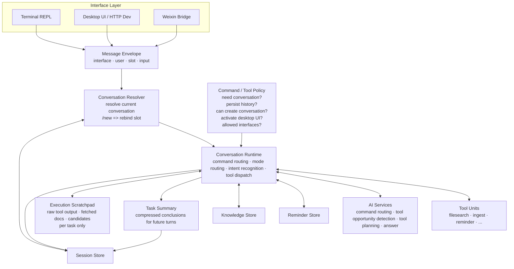

# baize · 白泽

<p align="center">
  
</p>

<p align="center">
  <strong>知天下万物 &nbsp;·&nbsp; 能言人语 &nbsp;·&nbsp; bái zé</strong>
</p>

> 《山海经》：黄帝巡狩，东至海，登桓山，于海滨得白泽神兽。  
> 能言语，达于万物之情。以其言，遂图写以示天下。

**baize**（白泽）取自山海经神兽，遍知天下万物、能言人语，为君主解答一切疑问。以此为名，寓意本项目作为个人的全知对话核心，跨端响应、随问随答。

---

`baize` 是一个跨终端、桌面和微信三种入口的个人智能助理，以统一的对话内核为中心，通过不同接口向用户暴露能力。

## 设计原则

- 终端、桌面、微信端均为接口层，负责收发消息与展示结果，不定义核心业务语义。
- 核心流程：先解析当前对话，再处理消息。命令、提问、工具调用统一建立在会话解析结果之上。
- AI 是通用决策器：识别需求 → 匹配工具 → 生成调用方案 → 按结果迭代，最多 3 轮。
- `/new` 的语义是"把当前接口槽位重新绑定到新对话"，而非执行特殊命令。
- 命令与工具的行为策略（是否写历史、是否创建新对话、是否激活桌面 UI）由统一策略层决定，不在接口层硬编码。
- 上下文分三层：任务 scratchpad（原始中间产物）→ 任务摘要（写入下一轮上下文）→ 会话历史（筛选后的对话记忆）。
- desktop 与 weixin 的 agent tool 候选集默认保持一致，仅在平台限制或用户主动关闭时允许差异。

## 目标架构



## 功能

- 运行时状态统一存储于本地 `app.db`，密钥单独保存在 `model/secret.key`
- 对话默认走 `agent` 模式；可用 `@ai` 切换为传统问答，`@kb` 附加知识库检索
- 桌面端新建对话时选择 `ask` 或 `agent`，模式随会话固定
- 支持图片直接入库（视觉摘要）；PDF 经 `go-fitz` 提取全文后摘要
- 支持 `screen_capture`：抓取屏幕、落临时 JPEG，可选视觉摘要
- 支持 `ScreenTrace`：后台定时截图、去重、视觉分析、时间段摘要
- 支持 macOS `osascript_tool`：读取 / 激活前台应用与窗口
- 支持 Windows `windows_automation_tool`：列举 / 聚焦顶层窗口
- 支持单次与每日重复提醒，桌面与微信来源统一展示
- 微信桥接：扫码登录、长轮询、文本 / 语音文字收发
- 不做向量检索、权限隔离或多租户

## 目录

```text
cmd/baize                CLI / terminal 入口
cmd/baize-desktop        Wails 桌面端与 HTTP dev 入口
cmd/baize-eval           模型评估 CLI
internal/app             统一对话运行时、会话逻辑、命令分发
internal/ai              AI 命令路由、工具决策、回答与摘要
internal/filesearch      文件检索工具单元
internal/knowledge       本地知识库存储
internal/modelconfig     模型配置读取与存储
internal/reminder        提醒调度与持久化
internal/runtimepolicy   跨接口共享的命令/输入策略
internal/taskcontext     任务 scratchpad 与摘要状态
internal/terminal        终端接口适配
internal/toolcontract    统一工具契约定义
internal/weixin          微信接口适配与消息桥接
internal/dirlist         list_directory 工具单元
internal/bashtool        bash_tool 工具单元（Linux/macOS 只读 shell）
internal/powershelltool  powershell_tool 工具单元（Windows 只读 PowerShell）
internal/sessionstate    会话快照持久化
internal/skilllib        技能加载与管理
internal/fileingest      图片与 PDF 摄入
internal/osascripttool   macOS 自动化工具单元
internal/screencapture   屏幕截图工具单元
internal/windowsautomationtool  Windows 桌面自动化工具单元
internal/screentrace     桌面活动记录（定时截图 / 摘要 / digest）
internal/promptlib       提示词模板管理
internal/projectstate    项目运行时状态跟踪
internal/sqliteutil      SQLite 公共工具函数
```

相关文档：

- [docs/ai-stage-eval.md](./docs/ai-stage-eval.md)：AI 阶段评测说明
- [docs/tool-units.md](./docs/tool-units.md)：工具单元规范
- [docs/development-issues.md](./docs/development-issues.md)：开发问题记录

## 运行

同一用户环境下只允许一个 `baize` 进程，重复启动会直接报错退出。

### 终端模式

```bash
go run ./cmd/baize
```

### 桌面模式（Wails）

```bash
go run ./cmd/baize-desktop
```

桌面端功能：图片 / PDF 导入、知识库管理、模型配置、活动记录、微信扫码登录、对话面板、工具能力页面。

数据目录默认位置：

- Windows：`%LOCALAPPDATA%\baize\data`
- Linux / macOS：系统用户配置目录下 `baize/data`

可通过 `-data-dir` 参数或 `BAIZE_DATA_DIR` 环境变量覆盖。

模型配置通过桌面端界面管理，API Key 加密存储，前端仅显示掩码。

Windows PowerShell 启动终端：

```powershell
.\scripts\run-terminal.ps1
```

### HTTP Dev 模式

在浏览器中调试前端，不启动 Wails 窗口：

```bash
make dev                                  # 默认 http://127.0.0.1:3415
make dev HTTP_DEV_ADDR=127.0.0.1:8080
```

### 模型评估模式

```bash
go run ./cmd/baize-eval -dataset docs/evals/route-command.jsonl
go run ./cmd/baize-eval -dataset docs/evals/route-command.jsonl -output eval/testdata/runs/result.json
```

参数：`-data-dir`（数据目录）、`-dataset`（必填）、`-output`（结果输出路径）。

### 微信登录与桥接

```bash
go run ./cmd/baize -weixin-login   # 输出 qrcode_img_content，生成二维码后扫码
go run ./cmd/baize -weixin         # 启动微信桥接
BAIZE_WEIXIN_ENABLED=1 go run ./cmd/baize
```

## 常用命令

```
/kb remember <内容>          记住一条知识
/kb remember-file <路径>     摄入文件
/kb append <ID> <内容>       追加补充
/kb forget <ID>              删除
/kb list / /kb stats         查看知识库
/kb new <名称>               创建知识库
/kb switch <名称>            切换知识库
/kb clear                    清空

/notice <时间> <内容>        设置提醒（支持"2小时后"、"每天 09:00"、绝对时间）
/notice list                 查看提醒
/notice remove <ID>          删除提醒

/skill list                  查看技能库
/skill show <名称>           查看技能内容
/skill load / unload <名称>  加载 / 卸载技能
/skill clear                 清空已加载技能

/prompt list                 查看提示词
/prompt use <ID前缀>         启用提示词
/prompt clear                清除

@ai <消息>                   单条走传统问答
@kb <消息>                   单条附加知识库检索
@agent <消息>                单条显式走 agent 模式

/debug-search <查询>         调试检索
```

文件摄入：图片走视觉摘要；PDF 用 `go-fitz` 提取全文后摘要。默认构建使用 `CGO_ENABLED=0`，PDF 提取需加 `-UseCgo`。

## 技能库

技能由人工控制，模型不自动决策：

1. `/skill list` 查看可用技能
2. `/skill show <名称>` 确认内容
3. `/skill load <名称>` 手动加载到当前会话

技能文件格式（`<data-dir>/skills/<名称>/SKILL.md`）：

```md
---
name: writer
description: 帮助输出更清晰的中文写作
---

# Writer
给出简洁、结构清晰、少废话的中文输出。
```

desktop 端导入 `.zip` skill 包时，zip 内须有且仅有一个 `SKILL.md`，位于根目录或唯一顶层目录下，frontmatter 中 `name` 和 `description` 均不可为空。

## 对话模式

普通对话默认走 `agent` 模式，模型自主决定是否调用工具。工具注册已抽为 provider，可挂接 MCP / NCP / ACP：

```go
service.RegisterMCPToolProvider("docs", myMCPClient)
service.RegisterNCPToolProvider("desktop", myNCPClient)
service.RegisterACPToolProvider("wechat", myACPClient)
```

注册后工具名格式为 `mcp.docs::lookup`、`ncp.desktop::open_app` 等，按 provider 前缀分发执行。

## 编译

### Windows

```powershell
.\scripts\build-windows.ps1          # amd64，CGO_ENABLED=0
.\scripts\build-windows.ps1 -All     # amd64 + arm64
.\scripts\build-windows.ps1 -UseCgo  # 启用 go-fitz PDF 提取
```

输出：`dist/baize-windows-amd64.exe`、`dist/baize-windows-arm64.exe`

### Release 包

```bash
make release   # 跑测试 + 编译全平台 + 生成 zip
```

产物落在 `dist/packages/`，包含各平台 zip（内含可执行文件与启动脚本）。

### 桌面安装包（Windows NSIS）

```powershell
.\scripts\build-desktop-windows-portable.ps1 -Arch amd64
.\scripts\package-desktop-windows.ps1 -Version 0.1.0
```

加 `-DebugMode` 可在页面右下角启用 `Desktop Diagnostics` 面板，用于排查 Wails bridge 问题。GitHub Actions 手动触发时自动开启，tag push 构建保持普通模式。

### 桌面安装包（macOS DMG）

由 `.github/workflows/macos-app.yml` 在 `macos-latest` 上构建、签名、公证并上传 DMG artifact。

需在 GitHub Secrets 配置：`MAC_CERT_P12_BASE64`、`MAC_CERT_PASSWORD`、`APPLE_ID`、`APPLE_APP_PASSWORD`、`APPLE_TEAM_ID`。

本地签名：

```bash
MAC_CERT_P12_BASE64=... MAC_CERT_PASSWORD=... APPLE_ID=... \
APPLE_APP_PASSWORD=... APPLE_TEAM_ID=... \
./scripts/package-desktop-macos.sh 1.0.0
```

### Windows 开机自启

```powershell
.\scripts\install-autostart.ps1    # 安装（隐藏窗口，自动带 -weixin）
.\scripts\uninstall-autostart.ps1  # 卸载
```

数据目录：`%LOCALAPPDATA%\baize\data`，日志：`%LOCALAPPDATA%\baize\logs\baize.log`。

### Linux 交叉编译

```bash
make build-linux    # linux/amd64 + arm64
make build-windows  # windows/amd64 + arm64
make build-macos    # darwin/amd64 + arm64
make release        # 全平台
```

## Commit 规范

```
feat(scope): summary
docs(scope): summary
chore(scope): summary
```

安装 hook：

```bash
make install-hooks          # Linux / macOS
.\scripts\install-hooks.ps1 # Windows
```

## 数据文件

| 路径 | 内容 |
|------|------|
| `data/app.db` | 知识库、提醒、会话、prompt、项目状态、桌面设置、微信绑定 |
| `data/model/secret.key` | 模型 API Key 加密主密钥 |
| `data/weixin-bridge/account.json` | 微信登录凭证 |
| `data/weixin-bridge/sync_buf` | 微信长轮询游标 |

## 微信桥接

当前实现使用以下最小 API 子集：`get_bot_qrcode`、`get_qrcode_status`、`getupdates`、`sendmessage`。
